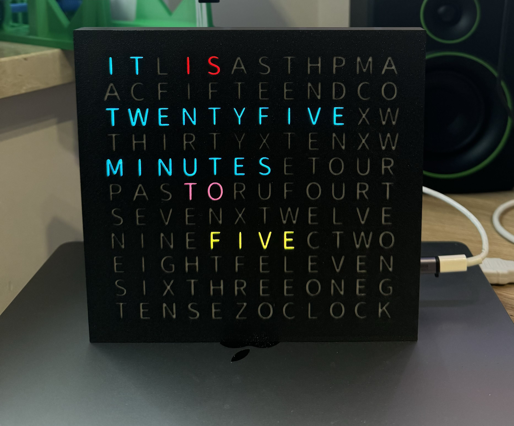

# Word Clock Project
## Overview
The Word Clock project features two main platforms: ESP32 and Raspberry Pi. This project allows you to display the time in a creative word format and includes functionalities for handling GIF animations.


Yo can find printing models on https://makerworld.com/en/models/686196#profileId-614840


## Directory Structure
```
word-clock-main/
├── .gitignore
├── README.md
├── esp/
│   └── wordclock/
└── raspberry-pi/
    ├── heart_art_small.gif
    ├── install.sh
    ├── requirements.txt
    ├── src/
    │   └── wordclock/
    │       ├── __init__.py
    │       ├── clock_display_hal.py
    │       ├── gif.py
    │       ├── main.py
    │       └── word_clock.py
    └── sync.sh
```

## Setup Instructions

### Raspberry Pi

1. **Clone the Repository**
   ```bash
   git clone git@github.com:johniak/word-clock.git
   cd word-clock-main/raspberry-pi
   ```

2. **Install Dependencies**
   Ensure you have the required dependencies installed. Run the following command:
   ```bash
   sudo apt-get install python3 python3-pip
   pip3 install -r requirements.txt
   ```

3. **To start as a service. Run the Install Script**
   The `install.sh` script will set up the necessary configurations. Run the following command:
   ```bash
   chmod +x install.sh
   ./install.sh
   ```

4. **To start the word clock application without a service, use:**
   ```bash
   sudo python3 src/wordclock/main.py --pin D12 --brightness 0.5 --gif ../../heart-art.gif
   ```

5. **Setup as a Service**
   If you want to run the word clock as a service, ensure the service is configured correctly in your system.

### ESP32

1. **Setup PlatformIO**
   Make sure you have [PlatformIO](https://platformio.org/) installed in your IDE.

2. **Open the Project**
   Open the `wordclock` directory in PlatformIO.

3. **Upload the Code**
   Connect your ESP32 board to your computer and upload the code using the PlatformIO upload button.

## Synchronization

The `sync.sh` script is included to help synchronize files between a source directory and a target directory in real-time. This ensures that any changes made in the source directory are reflected in the target directory.

### How to Use Sync Script

1. **Run the Sync Script**
   To synchronize the files, execute the following command in the terminal:
   ```bash
   chmod +x sync.sh
   ./sync.sh /path/to/source /path/to/target
   ```
   Replace `/path/to/source` and `/path/to/target` with the actual paths you want to synchronize.

2. **Automatic Sync**
   You can run this script in the background or set it up as a service to keep your directories synchronized without needing to run the script manually each time.

## Development Guidelines

- **Code Structure**: Follow the existing file organization within the `src/wordclock` directory. This helps maintain clarity in functionality.

- **Comments**: Keep comments to the most important parts of the code, as specified in your development preferences.

- **Contributing**: For any contributions or issues, please raise a pull request or create an issue in the GitHub repository.

## Notes

- Ensure that your Raspberry Pi has a stable internet connection for the initial setup and for the synchronization process.
- For the ESP32, make sure you have the correct board selected in PlatformIO.
