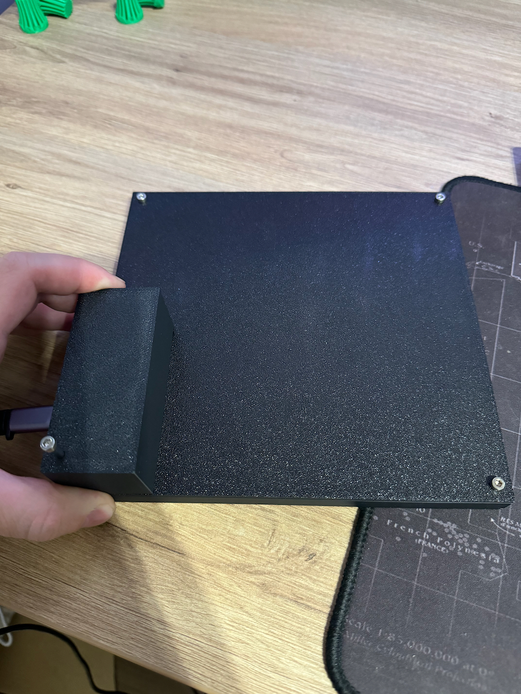

# Build instruction

## Prerequisite

1. Print all elements:
   1. Front plate
   2. Back plate
   3. Electronics compartment
2. Buy all necessary items:
   1. 2 meters of 74 LEDs per meter WS2812b LED strip (available on AliExpress or other stores, e.g. [https://bit.ly/4h5gCCm](https://bit.ly/4h5gCCm))
   2. ESP32 or Raspberry Pi Zero W (you need only one controller)
   3. 3x M3x10mm hex screws and 1x M3x40mm hex screw
   4. Soldering iron to connect LED strip segments
   5. Wires for electrical connections

## Building process

1. Cut the LED strip into 12-LED segments.
2. Place them on the printed back plate in a zigzag pattern starting from the cable hole (refer to the picture).
   You can find arrows on the LED strip, which should be aligned with the arrows in the picture. You can glue them between the positioning elements on the back plate.

   

3. Solder a cable that you will connect to the controller (Raspberry Pi or ESP32) later. You may use a cable with a connector, but it is not necessary.

4. Solder wires to your controller of choice:
   1. For Raspberry Pi Zero (refer to the pictures)
   
         
      

   2. For ESP32 (there are many different revisions):
      1. GND to GND
      2. SIGNAL to D13
      3. 5V to 5V or VIN, depending on the board. VIN is 5V when powering the board from USB.
5. Solder wires between the LED strip segments. Use three wires between each segment.

      

6. Upload the program to the microcontroller of your choice according to the instructions for Raspberry Pi Zero or ESP32. Disconnect it from power before proceeding with the next steps. Attach the front plate, ensuring that the cable is in the bottom right corner.
   

8. Screw in the three shorter screws—use all but the bottom right one.

9. Place your controller in the electronics compartment and connect the USB cable (I know it is not nicely fitted around the controller, I will improve that).

10. Align the electronics compartment with the hole for the last screw. This box also functions as a stabilizing leg for the whole clock.

11. Power on the controller. Wait a little bit for it to start.

