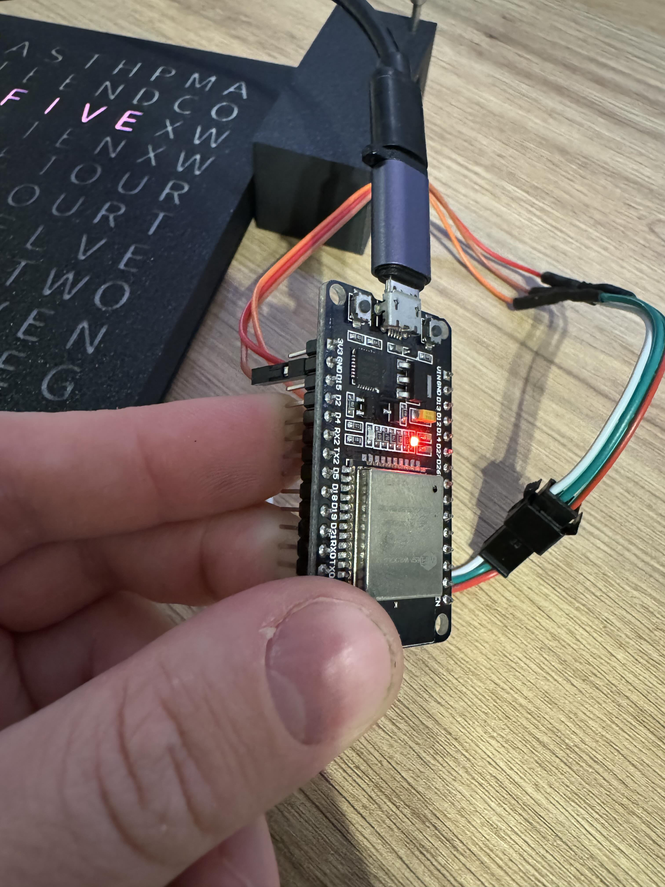
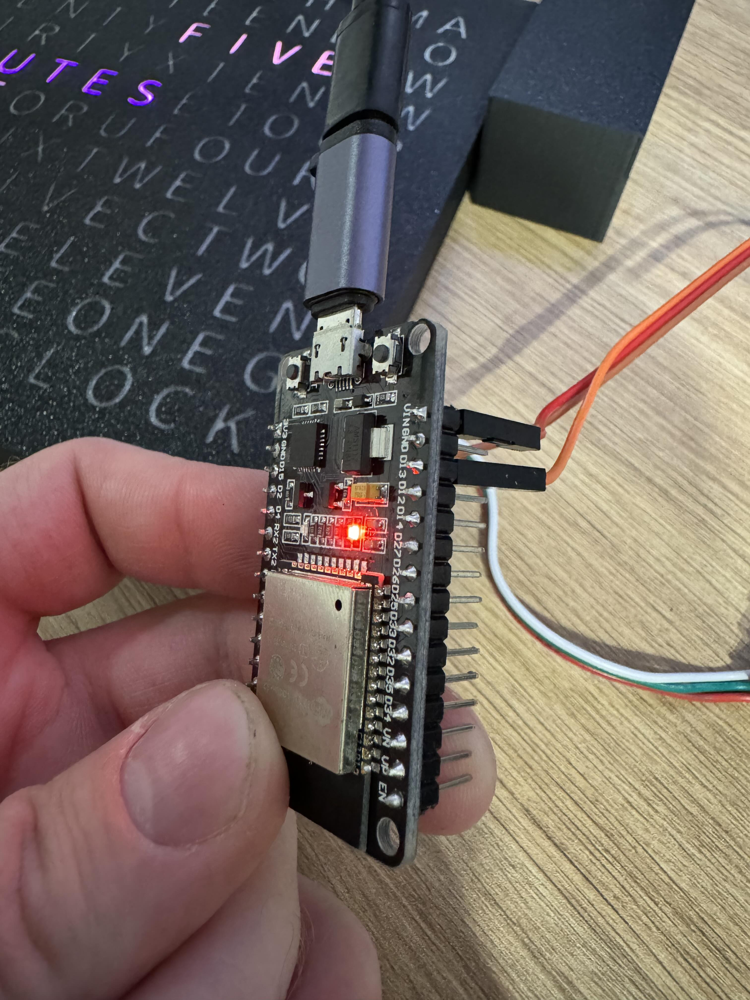
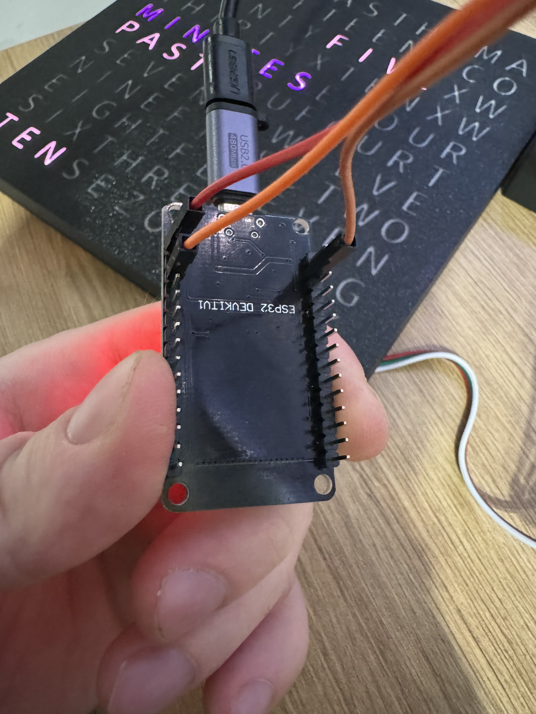

# ESP32 Devkit 1 Example Wiring

This document describes how to wire the ESP32 Devkit 1 to the WS2812b LED strip for the Word Clock project.

Remember there is many different ESP32 board revisions, so the wiring may vary. This example is for the ESP32 Devkit 1.

Be sure to check the datasheet of your board to find the correct pins.

In this example, we will use the following pins:
GND to GND - BROWN wire
SIGNAL to D13 - ORANGE wire
5V to VIN - RED wire

